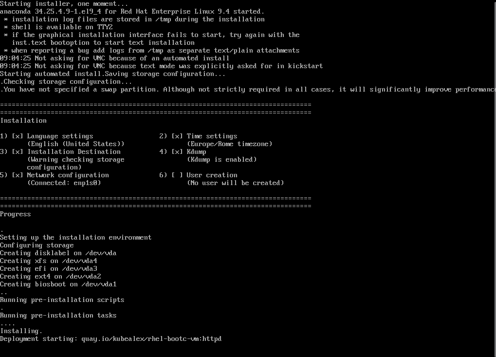

# Use Case - RHEL Bootc container as a setup source for Kickstart/Anaconda

In this example, we will expand the image we built in the [Apache bootc use case](../bootc-container-httpd/README.md) that you can use as a reference for details.
This way, we will be able to streamline the creation of VMs based on a frozen, immutable configuration that will take few seconds to be deployed.

The Containerfile.anaconda in the example:

- Updates packages
- Installs tmux and mkpasswd to create a simple user password
- Creates a *bootc-user* user in the image
- Adds the wheel group to sudoers
- Installs [Apache Server](https://httpd.apache.org/)
- Enables the systemd unit for httpd
- Adds a custom index.html
- Customizes the Message of the day

<details>
  <summary>Review Containerfile.anaconda</summary>
  ```dockerfile
  --8<-- "use-cases/bootc-container-anaconda-ks/Containerfile.anaconda"
  ```
</details>

## Pre-requisites

You need a Container registry to push the image and make it available. I suggest creating an account [on Quay.io](https://quay.io/).
During the configuration I will be using my username, *kubealex*, for the demo.

## Building the image

From the root folder of the repository, switch to the use case directory:

```bash
cd use-cases/bootc-container-anaconda
```

You can build the image right from the Containerfile using Podman:

```bash
podman build -f Containerfile.anaconda -t rhel-bootc-vm:httpd .
```

## Tagging and pushing the image

To tag and push the image you can simply run (replace **YOURQUAYUSERNAME** with the account name):


```bash
export QUAY_USER=YOURQUAYUSERNAME
```

```bash
podman tag rhel-bootc-vm:httpd quay.io/$QUAY_USER/rhel-bootc-vm:httpd
```

Log-in to Quay.io:

```bash
podman login -u $QUAY_USER quay.io
```

And push the image:

```bash
podman push quay.io/$QUAY_USER/rhel-bootc-vm:httpd
```

You can now browse to [https://quay.io/repository/YOURQUAYUSERNAME/rhel-bootc-httpd?tab=settings](https://quay.io/repository/YOURQUAYUSERNAME/rhel-bootc-httpd?tab=settings) and ensure that the repository is set to **"Public"**.


## Install RHEL 9.5 using the resulting image

### Prepare install media and review the kickstart file

RHEL 9.5 ISO images are available on the [Red Hat Developer portal](https://developers.redhat.com/content-gateway/file/rhel/Red_Hat_Enterprise_Linux_9.5/rhel-9.5-x86_64-boot.iso) and for this use case we will only need the boot image.

Save the image and place it in the use case folder with the name **rhel9.iso**

The kickstart file is a very simple one:

- Configures text install
- Creates a *root* user with password *redhat*
- Sets up basic partitioning

What is relevant is the **ostreecontainer** directive, that references the container image we just built as a source for the installation!

<details>
  <summary>Review ks.cfg</summary>
  ```dockerfile
  --8<-- "use-cases/bootc-container-anaconda-ks/ks.cfg"
  ```
</details>


### Creating the Virtual Machine in KVM

You are now ready to spin-up a Virtual Machine using the downloaded boot image for RHEL 9.5, injecting and using the kickstart to perform an unattended installation.

```bash
virt-install --name rhel9-server \
--memory 4096 \
--vcpus 2 \
--disk size=20 \
--network network=default \
--location ./rhel9.iso \
--os-variant rhel9.5 \
--initrd-inject ks.cfg \
--extra-args "inst.ks=file:/ks.cfg"
```

In a few seconds, the VM will boot and start the installation, grabbing the container image as a source to perform the configuration:



Based on the connection, it can take a while to fetch the container image and complete the setup. Once it is completed, you can log-in with the **bootc-user/redhat** credentials, and you will see the custom Message Of The Day (MOTD) we added in our Containerfile!


