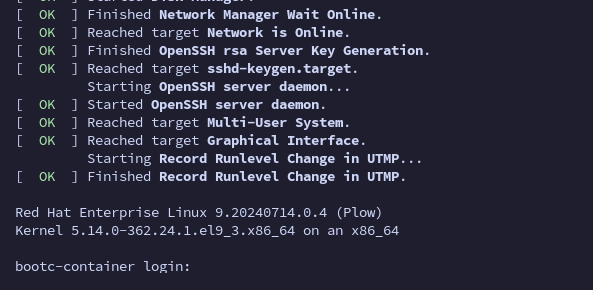

# Use Case - Simple RHEL bootc container

This example shows a very simple example of a bootc container the is built starting from a *rhel-bootc* image.

The Containerfile in the example:

- Updates packages
- Installs tmux and mkpasswd to create a simple user password
- Creates a *bootc-user* user in the image
- Adds the wheel group to sudoers

<details>
  <summary>Review Containerfile.simple</summary>
  ```dockerfile
  --8<-- "use-cases/bootc-container-simple/Containerfile.simple"
  ```
</details>

## Building the image

From the root folder of the repository, switch to the use case directory:

```bash
cd use-cases/bootc-container-simple
```

To build the image:

```bash
podman build -f Containerfile.simple -t rhel-bootc-simple .
```

You can now run it using:

```bash
podman run -it --name bootc-container --hostname bootc-container -p 2022:22 rhel-bootc-simple
```

Note: The *"-p 2022:22"* part forwards the container's SSH port to the host 2022 port.

The container will now start and a login prompt will appear:



You can simply login with *bootc-user/redhat* and play around with the container content!
