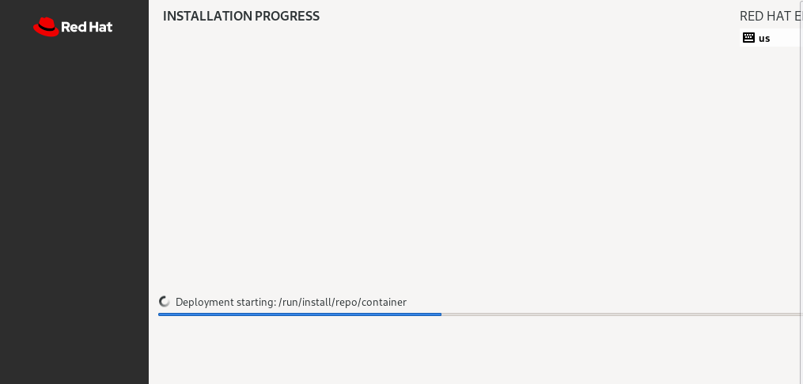

# Use Case - Building a RHEL ISO image using bootc-image-builder

In this example, we will build a container image from a Containerfile and we will generate a ISO image to spin up a Virtual Machine in KVM and install RHEL from the container image.

The Containerfile in the example:

- Updates packages
- Installs tmux and mkpasswd to create a simple user password
- Creates a *bootc-user* user in the image
- Adds the wheel group to sudoers
- Installs [Apache Server](https://httpd.apache.org/)
- Enables the systemd unit for httpd
- Adds a custom index.html

<details>
  <summary>Review Containerfile.iso</summary>
  ```dockerfile
  --8<-- "use-cases/bootc-image-builder-iso/Containerfile.iso"
  ```
</details>

## Building the image

From the root folder of the repository, switch to the use case directory:

```bash
cd use-cases/bootc-image-builder-iso
```

To build the image:

```bash
podman build -f Containerfile.iso -t rhel-bootc-vm:iso .
```

## Testing the image

You can now test it using:

```bash
podman run -it --name rhel-bootc-vm --hostname rhel-bootc-vm -p 8080:80 rhel-bootc-vm:iso
```

Note: The *"-p 8080:80"* part forwards the container's *http* port to the port 8080 on the host to test that it is working.

The container will now start and a login prompt will appear:


On another terminal tab or in your browser, you can verify that the httpd server is working and serving traffic.

**Terminal**

```bash
 ~ ▓▒░ curl localhost:8080
Welcome to the bootc-http instance!
```

**Browser**


## Tagging and pushing the image

To tag and push the image you can simply run (replace **YOURQUAYUSERNAME** with the account name):


```bash
export QUAY_USER=YOURQUAYUSERNAME
```

```bash
podman tag rhel-bootc-vm:httpd quay.io/$QUAY_USER/rhel-bootc-vm:iso
```

Log-in to Quay.io:

```bash
podman login -u $QUAY_USER quay.io
```

And push the image:

```bash
podman push quay.io/$QUAY_USER/rhel-bootc-vm:iso
```

## Customize the image

In this example, we will not create the user in the image, but we will provide a customization using the **config.toml** file. It can be used to perform customizations of users, groups, etc.

A sample *config.toml* is already present in the use case directory, that we will use to create our **bootc-user/redhat** and add it to the **wheel** group is as follows:

```toml
  --8<-- "use-cases/bootc-image-builder-iso/config.toml"
```

## Generating the ISO image

To generate the ISO image we will be using [bootc-image-builder](https://github.com/osbuild/bootc-image-builder) container image that will help us transitioning from our newly generated bootable container image to a ISO file that can be used with KVM to install the OS.

The bootc-image-builder container will need **rootful** access to run, let's proceed with the ISO image creation:

```bash
sudo podman run \
    --rm \
    -it \
    --privileged \
    --pull=newer \
    --security-opt label=type:unconfined_t \
    -v $(pwd)/output:/output \
    -v /var/lib/containers/storage:/var/lib/containers/storage \
    registry.redhat.io/rhel9/bootc-image-builder:latest \
    --type iso \
    quay.io/$QUAY_USER/rhel-bootc-vm:iso
```

We will use the image we pushed before to create our image in the **output** folder.

The process will take care of all required steps (deploying the image, SELinux configuration, filesystem configuration, ostree configuration, etc.), after a couple of minutes we will find in the output:

```bash
Generating manifest manifest-iso.json
DONE
Building manifest-iso.json
starting -Pipeline source org.osbuild.containers-storage: f1027594ecbee0b434f86af01d4ba21b478265c0c773e35c387858d0fc4bf16d
Build
  root: <host>
Pipeline source org.osbuild.curl: 07337b98b3c859adfb37b011d83cf0511884147bf999e7869ffbf9074b529a4f
Build
  root: <host>
[...]

⏱  Duration: 9s
org.osbuild.implantisomd5: 3798a4bfccd982e2e24d6130c4174eba98ad12f94a41b25ec8884a8cfccaf8ce {
  "filename": "install.iso"
}
['implantisomd5', '/run/osbuild/tree/install.iso']
Inserting md5sum into iso image...
md5 = 66adac8cb9127c31942085bade81a8d4
Inserting fragment md5sums into iso image...
fragmd5 = 9d5d936a1b5c8f9bf96e1e14c164898d8e2fcf45652dbee6f3741e17b5ca
frags = 20
Setting supported flag to 0

⏱  Duration: 6s
manifest - finished successfully
build:          9133fb8610ab053dae7e281e6a6655dbb912c4530d32e4da75c06b8713a87c80
anaconda-tree:  fcd61d1236a42900977530f12f45fe452f2f0c8bf3c80a7ba60cb45ffe4bf36d
rootfs-image:   0a517e05ab42f947beec8dae4d2da338ca9cc7fe17b1daba013e24b1c60aeadf
efiboot-tree:   61a20c820b40436ce7bd6d1a74c6b97a05f7c8800b678083942e814cf9f7cc0e
bootiso-tree:   fd0185a1c0eb53df152acd85195c016315e79dd5dc32eb32d07abf0e21251c62
bootiso:        3798a4bfccd982e2e24d6130c4174eba98ad12f94a41b25ec8884a8cfccaf8ce
Build complete!
Results saved in

```

Verify that under the *output/bootiso* folder we have our image ready to be used.

```bash
 ~/ ▓▒░ tree output
output/
├── bootiso
│   └── install.iso
└── manifest-iso.json
```

## Create the VM in KVM

We will now use the image to spin up our Virtual Machine in KVM.

```bash
sudo virt-install \
    --name rhel-bootc-vm \
    --vcpus 4 \
    --memory 4096 \
    --cdrom ./output/bootiso/install.iso \
    --os-variant rhel9.4 \
    --disk size=20 \
    --network network=default
```

We can check that the installer is running using the VM Console:



Wait for the VM to be ready and retrieve the IP address for the domain to log-in using SSH using *bootc-user/redhat* credentials:

```bash
 ~ ▓▒░ VM_IP=$(sudo virsh -q domifaddr rhel-bootc-vm | awk '{ print $4 }' | cut -d"/" -f1) && ssh bootc-user@$VM_IP
Warning: Permanently added '192.168.124.209' (ED25519) to the list of known hosts.
bootc-user@192.168.124.209's password: 
This is a RHEL 9.4 VM installed using a bootable container as an rpm-ostree source!
[bootc-user@localhost ~]$ 
```

