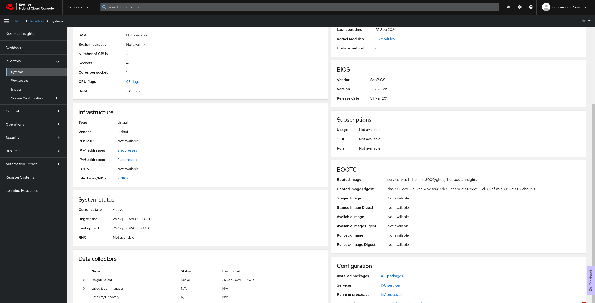
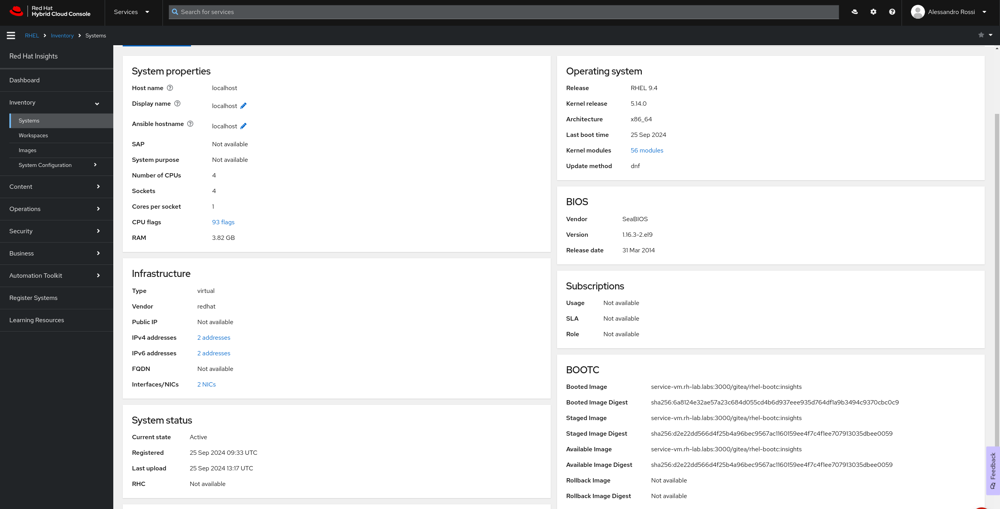
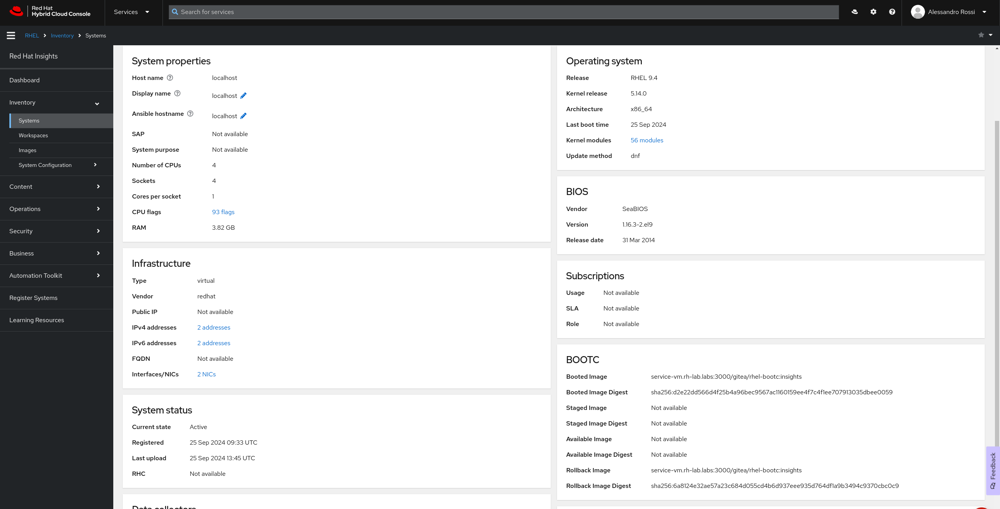

# Use Case - Managing a RHEL Image Mode instance with Red Hat Insights.

In this example, we will build a container image from a Containerfile and we will generate a QCOW image to spin up a Virtual Machine in KVM and manage it with [Red Hat Insights](https://console.redhat.com/insights/dashboard)

The Containerfile in the example:

- Updates packages
- Installs tmux and mkpasswd to create a simple user password
- Creates a *bootc-user* user in the image
- Adds the wheel group to sudoers
- Installs Insights Client
- Adds a custom Message of the Day

<details>
  <summary>Review Containerfile.insights</summary>
  ```dockerfile
  --8<-- "use-cases/image-mode-management-insights/Containerfile.insights"
  ```
</details>

## Building the image

From the root folder of the repository, switch to the use case directory:

```bash
cd use-cases/image-mode-management-insights
```

To build the image:

```bash
podman build -f Containerfile.insights -t rhel-bootc-vm:insights .
```

## Tagging and pushing the image

To tag and push the image you can simply run (replace **YOURQUAYUSERNAME** with the account name):


```bash
export QUAY_USER=YOURQUAYUSERNAME
```

```bash
podman tag rhel-bootc-vm:ami quay.io/$QUAY_USER/rhel-bootc-vm:insights
```

Log-in to Quay.io:

```bash
podman login -u $QUAY_USER quay.io
```

And push the image:

```bash
podman push quay.io/$QUAY_USER/rhel-bootc-vm:insights
```

## Generating the QCOW image

To generate the QCOW image we will be using [bootc-image-builder](https://github.com/osbuild/bootc-image-builder) container image that will help us transitioning from our newly generated bootable container image to a VM image that can be used with KVM.

Let's proceed with the QCOW image creation:

```bash
sudo podman run \
    --rm \
    -it \
    --privileged \
    --pull=newer \
    --security-opt label=type:unconfined_t \
    -v $(pwd)/output:/output \
    -v /var/lib/containers/storage:/var/lib/containers/storage \
    registry.redhat.io/rhel9/bootc-image-builder:latest \
    --type qcow2 \
    quay.io/$QUAY_USER/rhel-bootc-vm:insights
```

We will use the local image we just copied to save in the **output** folder our generated image.

The process will take care of all required steps (deploying the image, SELinux configuration, filesystem configuration, ostree configuration, etc.), after a couple of minutes we will find in the output:

```bash
Generating manifest-qcow2.json ... DONE
Building manifest-qcow2.json
starting -Pipeline source org.osbuild.containers-storage: 8aaabad5f0c2c00eb12666076be4e6843f04e262230e2976dbb1218e96f2ca53
Build
  root: <host>
Pipeline build: 2fb8b2a9ec9dc564950ddc6213d923bdd036c2328a97d0bb785c72fb5b6e1154
Build
  root: <host>
  runner: org.osbuild.rhel82 (org.osbuild.rhel82)
[...]

⏱  Duration: 81s
manifest - finished successfully
build:          2fb8b2a9ec9dc564950ddc6213d923bdd036c2328a97d0bb785c72fb5b6e1154
image:          a578f97344212ef8cdc1a53717b61d72b4cc89504811c7b73e35aafe9a4011e5
qcow2:          ae3acbc9afa8886b03ce112d57177e7a9e0a05819d3f0d7bba9fc0e2663fddf5
vmdk:           a926054ee74e3fa6193efc467be82ad7ff041e58db6712cabf19a82793cbc345
ovf:            02baf8c99f0322217499ddf7ca5f853b74f37926ab7739efc2e7e6dd87ecc8c1
archive:        beb1ba4cddc9a18f49f190d33d9a3ef0221b90d19683f810f170ec4629c55f39
Build complete!

```

Verify that under the *output/qcow2* folder we have our image ready to be used.

```bash
 ~/ ▓▒░ tree output
output
├── manifest-qcow2.json
└── qcow2
    └── disk.qcow2
```

## Create the VM in KVM

We will now use the image to spin up our Virtual Machine in KVM.

```bash
sudo virt-install \
    --name rhel-bootc-vm \
    --vcpus 4 \
    --memory 4096 \
    --import --disk ./output/qcow2/disk.qcow2,format=qcow2 \
    --os-variant rhel9.4 \
    --network network=default
```

## Register the VM with Red Hat Insights

Once the VM is up and running, log-in using the **bootc-user/redhat** credentials:

```bash
VM_IP=$(sudo virsh -q domifaddr rhel-bootc-vm | awk '{ print $4 }' | cut -d"/" -f1) && ssh bootc-user@$VM_IP
```

Register the VM with Red Hat Subscription Manager using your Red Hat ID:

```bash
sudo subscription-manager register
```

And then register it with Red Hat Insights:

```bash
sudo insights-client --register
```

After some seconds, the data will be uploaded and you can browse to [Red Hat Insights](https://console.redhat.com/insights/inventory) to check that your new host is registered. 

If you go in the host itsels (it should be registered as *localhost*) you will see a dedicated section called **BOOTC** where information about the current image in use is shown, as in the picture.



## Optional - Update the image and visualize the changes on Red Hat Insights

For showcasing how Red Hat Insights supports image updates, we also have an updated version, that adds an additional motd.

<details>
  <summary>Review Containerfile.insights-update</summary>
  ```dockerfile
  --8<-- "use-cases/image-mode-management-insights/Containerfile.insights-update"
  ```
</details>

### Building the image

From the root folder of the repository, switch to the use case directory:

```bash
cd use-cases/image-mode-management-insights
```

To build the image:

```bash
podman build -f Containerfile.insights-update -t rhel-bootc-vm:insights .
```

### Tagging and pushing the image

To tag and push the image you can simply run (replace **YOURQUAYUSERNAME** with the account name):


```bash
export QUAY_USER=YOURQUAYUSERNAME
```

```bash
podman tag rhel-bootc-vm:ami quay.io/$QUAY_USER/rhel-bootc-vm:insights
```

Log-in to Quay.io:

```bash
podman login -u $QUAY_USER quay.io
```

And push the image:

```bash
podman push quay.io/$QUAY_USER/rhel-bootc-vm:insights
```

### Updating the VM using the new image

Once the VM is up and running, log-in using the **bootc-user/redhat** credentials:

```bash
VM_IP=$(sudo virsh -q domifaddr rhel-bootc-vm | awk '{ print $4 }' | cut -d"/" -f1) && ssh bootc-user@$VM_IP
```

Run the bootc upgrade command to update the OS to the lastest version:

```bash
sudo bootc upgrade
```

Run the insights-client utility to see the changes, as the new image will be shown as *available* and no rollback images is available since the upgrade still isn't applied.

```bash
sudo insights-client
```

Verify on the Console that you see the updated info on the image:




Reboot the VM to apply the new update:

```bash
sudo reboot
```

And then re-run the Insights-client upload:

```bash
sudo insights-client
```

Now the new version is applied, and if you check the console, no new update is scheduled, but you can see the rollback image pointing to the pre-upgrade image:



